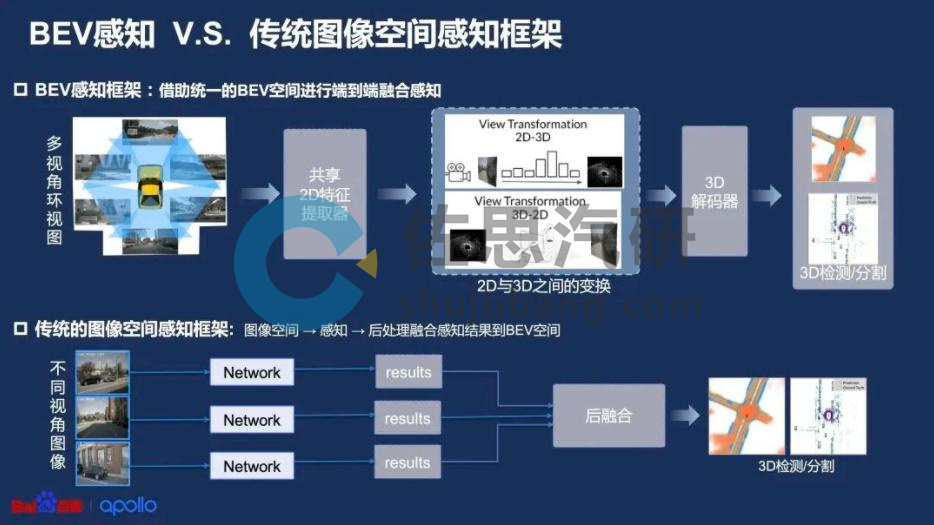
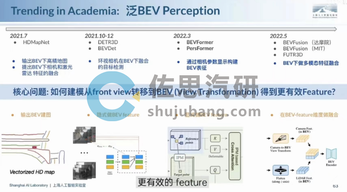
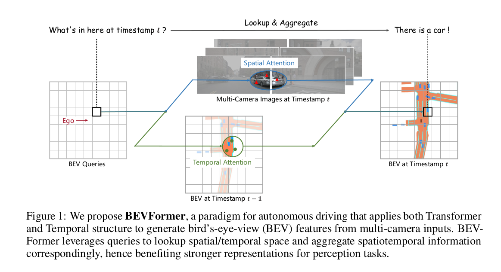
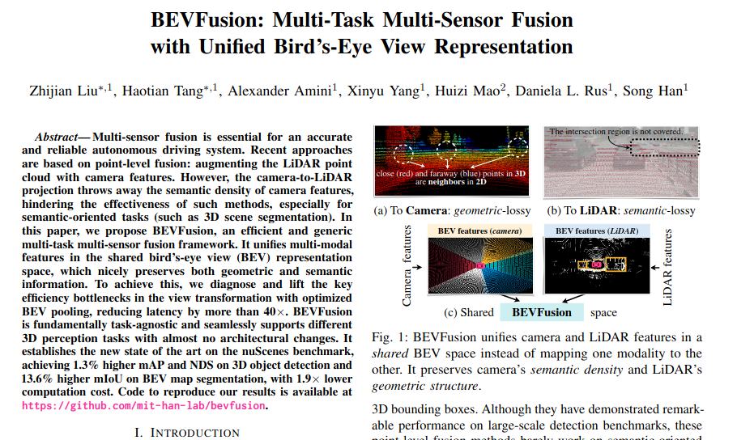

# BEV空间
## 什么是BEV空间
BEV空间的主要特点

俯视视角：模拟从正上方向下看的视角
统一坐标系：将所有物体投影到同一地面平面上
消除透视畸变：避免了前视图中近大远小的问题
## 基于传统方法的 BEV 空间转换
 BEV是Bird's Eye View（视觉为中心的鸟瞰图）的简写，也称作“上帝视角”，是一种端到端的，由神经网络将图像信息从图像空间转换到BEV空间的技术；
 
 从BEV技术落地来看，各家技术架构大致相同，但采取的技术方案有所不同。迄今，大致出现了三种技术路线：

1. 纯视觉BEV感知路线，代表企业为特斯拉；

2. BEV融合感知路线，代表企业为毫末智行；

3. 车路一体BEV感知路线，代表企业为百度。
后面2种不用看了，因为对应的企业都是奄奄一息了，所以直接过滤掉，省力气了！

 纯视觉BEV感知技术路线：特斯拉是纯视觉技术路线代表企业，2021年率先使用前融合BEV算法，将摄像头感知到的画面直接传到AI算法里，生成鸟瞰视角的3D空间，并在该空间内输出感知结果。包括汽车、行人等动态信息，车道线、交通标识、红绿灯、建筑物等静态信息，以及各元素的坐标位置、方向角、距离、速度、加速度等。
 ## 基于深度学习的 BEV 空间转换
 [BEV发展演进的脉络：](https://db.shujubang.com/home/login/index/gid/19289)
  

### 视觉的BEV特征提取
 这两年，深度学习也开始被应用于BEV空间转换，且逐渐成为主流方案。相比于依赖人为规则，使用神经网络从2D空间进行BEV空间转换，能够取得更好的感知效果。 具体的流程是，先通过一个共享的主干网络（Backbone）来提取每个相机的特征（feature），然后再通过Transformer等将多摄像头数据，[完成从图像空间到BEV空间的转换](https://github.com/yangshu2018/Autopilot-Updating-Notes/tree/main/ch03_%E6%84%9F%E7%9F%A5/3.3%20BEV%E9%B8%9F%E7%9E%B0%E5%9B%BE)

 
 >https://blog.csdn.net/qq_41204464/article/details/135035754
 ### 多模态下的BEV融合
 BEV空间内，由于坐标系相同，可以很方便地将图像数据和其他传感器数据（如Lidar、Radar等）进行融合，还可以进行时序融合形成4D空间，这也是当下BEV技术的大趋势
  
